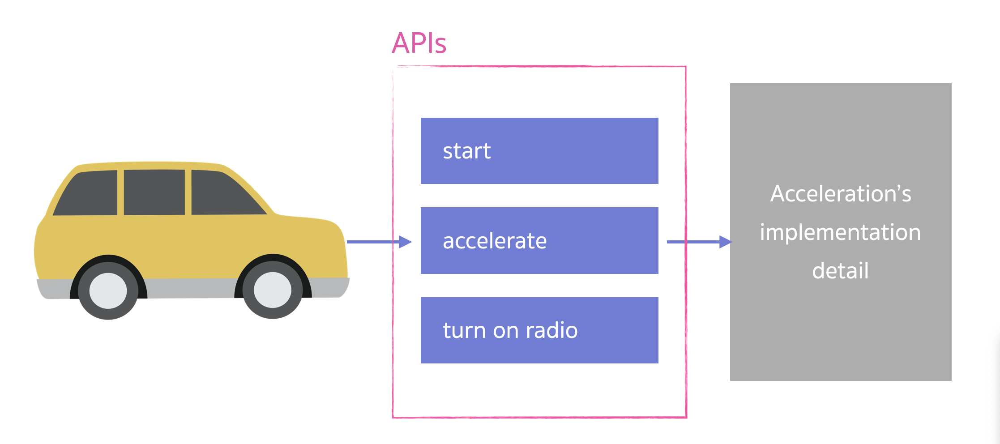

# API คืออะไรกันแน่นะ

**API (Application Programming Interface)** คือ ช่องทางที่จะทำให้เราสามารถที่จะ Interact กับ Software Components ได้ เราลองมาดูตัวอย่างกัน

ถ้าเรามองว่ารถยนต์ เป็น Software Component ตัวนึง เราสามารถทำอะไรกับมันได้บ้าง ? แน่นอนครับเราสามารถที่จะ เร่งความเร็ว, เบรค, หรือเปิดวิทยุ เป็นต้น สิ่งเหล่านี้สามารถเรียกได้ว่าเป็น API ของตัวรถยนต์ของเรา

แล้วการที่เราสามารถทำสิ่งเหล่านี้ได้ เราจะต้องมีวิธีการทำ เช่น ถ้าเราจะเร่งความเร็ว ของรถยนต์ เราต้องเอาเท้าเราไปเหยียบ และดันคันเร่งลง หลังจากที่เราเหยียบคันเร่งแล้ว รถก็สามารถที่จะวิ่งไปข้างหน้าได้ด้วยความเร็วที่เพิ่มขึ้น
ซึ่งกลไกเหล่านี้จะถูกเขียนโปรแกรมใส่ไว้ใน API
ถ้าเป็นคนขับเราไม่จำเป็นต้องรู้ว่าการทำงานข้างในของการเหยียบคันเร่งแล้วเกิดอะไรขึ้นบ้างภายในรถยนต์ เราสามารถที่จะทำให้รถยนต์นั้นเร่งความเร็วได้

API เป็นมาตรฐานในการที่ทำให้ Client และ Server ติดต่อกันได้ เพื่อที่จะเข้าถึงข้อมูล หรือทำธุรกรรมต่างๆ
ซึ่งทุกวันนี้ API จะอยู่ในรูปแบบของ RESTful ซะส่วนใหญ่ RESTful คือมาตรฐาน หรือรูปแบบในการเขียน API
ต่อไปเราจะไปลองทำความเข้าใจ และเล่น API ให้มากขึ้นกัน
