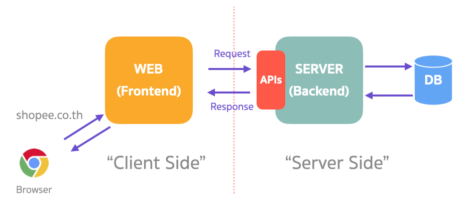
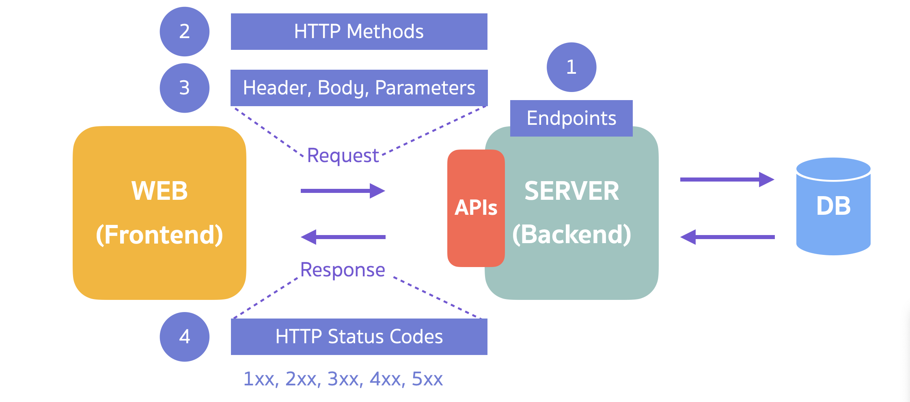

## ลองทำความเข้าใจ และเล่น API ให้มากขึ้น

เราลองมาดูการทำงานของ Web กันสักหน่อยก่อนที่จะไปกันต่อ



จากภาพด้านบน เราเปิดเว็บผ่าน Browser (ในที่นี้คือ Google Chrome) มาสัก 1 เว็บ

สมมุติว่าเป็นเว็บ Shopee สิ่งที่เราเห็นก็คือ เราจะเห็น รายการสินค้าที่เอามาจัด Flash Sale, สิ้นค้าติดอันดับ และเวลาเรากดเข้าไปตามหมวดหมู่เราก็จะเห็นสินค้าตามหมวดหมู่นั้น ๆ

สิ่งที่เราเห็นจะเป็นส่วนที่เรียกว่า Frontend ซึ่ง Frontend ก็คือส่วนแสดงผลของเว็บ จะมีข้อมูลต่าง ๆ ที่เรามองเห็น ข้อมูลพวกนี้จะถูกเก็บอยู่ที่ Database

การที่จะเอาข้อมูลมาแสดงที่ Frontend Frontend จะต้องทำการ Request ไปที่ Server

Request ตือ การติดต่อ Server

Server จะดึงข้อมูลที่อยู่ใน Database แล้วส่งกลับไปเป็น Response ให้ Frontend นำไปแสดงผล

เช่น ขอรายการสินค้า Flash Sale ตัว Server จะมีช่องทางการติดต่อกับ Frontend ช่องทางนี้แหล่ะ เราเรียกว่า API

## โครงสร้างของ RESTful API



**1. Endpoints** - เป็น URL ที่เป็นช่องทางในการเรียกใช้ API

ตัวอย่าง Endpoint

`https://dog.ceo/api/breeds/list/all`

**2. HTTP Methods** - เป็นตัวที่บอก Server ว่าเราจะทำการ Request แบบไหน รูปแบบจะมีดังนี้

- **GET** - เป็นการขอข้อมูลต่าง ๆ จาก Server
- **POST** - เป็นการขอสร้างข้อมูลกับ Server ด้วยสิ่งที่เราจะส่งให้
- **PUT** - เป็นการขอแก้ไข หรือการอัพเดทข้อมูล
- **DELETE** - เป็นการขอลบข้อมูล

**3.Headers, Body, Parameters** - เป็นสิ่งที่สามารถส่งไปพร้อม ๆ กันกับการเรียกใช้ API

- **Header** - เป็นตัวที่บอกข้อมูลเพิ่มเติมในการติดต่อกันระหว่าง Client และ Server

ยกตัวอย่างเช่น

`"Content-Type: application/json"`

Content-Type จะเป็นข้อมูลที่บอกว่า Request ที่เราจะส่งไปให้มี Format เป็น JSON

- **Body** - เป็นตัวข้อมูลเพิ่มเติมในการส่งไปหา Server เพื่อทำการสร้าง, แก้ไข, หรือลบข้อมูล ผ่าน HTTP Methods พวก POST, PUT, DELETE

ซึ่ง Body เราสามารถส่งได้หลายรูปแบบ ไม่ว่าจะเป็น JSON, XML (แต่ส่วนใหญ่ใช้ JSON กันนะ)

- **Parameters** - เป็นข้อมูลเพิ่มเติมในการขอข้อมูลด้วย GET

หน้าตาจะเป็นประมาณแบบนี้

`https://example.com?var1=foo&var2=bar`

สิ่งที่ต่อท้าย Endpoints ?_var1=foo_&_var2=bar_ พวกนี้เรียกว่า Query Parameters มันจะเริ่มด้วย ? และแบ่งระหว่างตัวแปรด้วย &

**4.Response** - Server สามารถตอบกลับได้ การตอบกลับสามารถตอบกลับได้หลายรูปแบบเหมือนกันนะไม่ว่าจะเป็น JSON หรือ XML

ตัวอย่างจะเป็นแบบนี้

```json
{
  "message": {
    "affenpinscher": [],
    "african": [],
    "airedale": [],
    "akita": [],
    "appenzeller": [],
    "australian": ["shepherd"],
    "basenji": [],
    "beagle": [],
    "bluetick": [],
    "borzoi": [],
    "bouvier": [],
    "boxer": [],
    "brabancon": [],
    "briard": [],
    "buhund": ["norwegian"],
    "bulldog": ["boston", "english", "french"],
    "bullterrier": ["staffordshire"]
  }
}
```

Response จะมี **HTTP Status Code** กลับมาด้วย ซึ่งเป็น Code ที่เอาไว้บอกสถานะของ Request ที่เข้ามาใน Server

HTTP Status Code จะแบ่งออกได้เป็น 5 หมวดหมู่ใหญ่ ๆ ดังนี้

**1xx** : Informational
เป็น Code ที่บอกว่า Request ของเรา OK แต่ ไม่ค่อยใช้กันในทั่วไป

**2xx** : เป็น Code ที่บอกว่า Request สำเร็จ
200 OK - เป็นมาตรฐานในการบอกว่า Request สำเร็จ
201 CREATED - เป็นการบอกว่า Request เข้ามาสร้างข้อมูลนั้นสำเร็จ

**3xx** : เป็นการ Redirect
301 Moved Permanently - เป็น Code ที่บอกว่า Request ที่จะเข้ามาในอนาคต ต้องเปลี่ยนไปเป็น Endpoint ใหม่

**4xx** : เป็น Code ที่บอกว่า Client มี Error
404 Not Found - Request ที่เข้ามาขอข้อมูลที่ไม่มีอยู่ในระบบ

**5xx** : เป็น Code ที่บอกว่า Server Error
500 Internal Server Error - มีความผิดปกติเกี่ยวกับการทำงานของตัว Server

## เรามาลองดูตัวอย่าง API จริง ๆ กัน

ให้เราเข้าไปที่ [Public APIs Repository](https://github.com/public-apis/public-apis) เราจะเลือก APIs ที่เกี่ยวกับสุนัขแล้วกัน [Dog API Documentation](https://dog.ceo/dog-api/documentation/) ตัวนี้เลย

พอเราเข้ามาเราจะเห็นเอกสารของตัว API เช่น List all breeds, Random Image อีกหลายๆอย่าง เราจะลองเล่น API List all breeds กัน ซึ่ง API เหล่านี้จะเป็น API ในการ GET คือขอข้อมูล

ถ้าเรา copy endpoint `https://dog.ceo/api/breeds/list/all` มาแปะที่ Web browser ของเราเราจะได้ก้อน Text ใหญ่ๆ ก้อนนึงมาให้เรา ก้อนนี้แหล่ะคือข้อมูลที่ได้มาจาก API ซึ่งเราสามารถนำไปใช้แสดงผลบนหน้าเว็บของเราได้

ซึ่งตัวอย่างข้างบนเราได้ลองเรียกใช้ API ที่มี HTTP Method เป็น GET ไปแล้ว ส่วน POST, PUT, DELETE เราจะได้ลองเขียนแล้วเล่นเองในบทเรียนต่อ ๆ ไป
